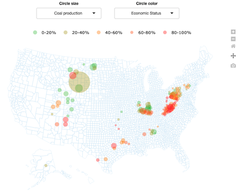

# energy_communities_usmap
 A plotly/shiny replica of the mapbox "Mapping US Energy Communities" from https://www.rff.org/publications/data-tools/mapping-vulnerable-communities/

Beyond this particular application, the app could serve as a useful template
for open source interactive maps of U.S. counties.

A static screenshot of the app:

This link may not work forever but for now (Jan. 10, 2022), a dynamic version of 
the app can be found at https://martinvanderlinden.shinyapps.io/energy_socioeco_map/
and can be embedded on any HTML webpage using an iframe (see, e.g., https://datasciencegenie.com/how-to-embed-a-shiny-app-on-website/)

There are a number of features I did not take the time to replicate from the original. These include:

- Circle-color-specific scales and legends,
- Tooltip formating (including adding units)
- Less "aggressive" tooltip (including smaller fonts)

There are also a number of features I couldn't find a quick way to replicated using Plotly. These include:

- "Bar legends",
- Gathering circle-color legend under circle-color selector,

Some things I like better about the original <apbox implementation:

- Zoom fluidity
- Seamless circle-color and circle-size changes (unlike my Shiny/Plotly implementation, the mapbox implementation does not appear to rebuild the whole graph each time the user changes inputs)

Some things I like better about my Plotly implementation:

- Ability to use the legend to select subsets of the data to be displayed (especially useful given the clutterness of the map for some input selections).

